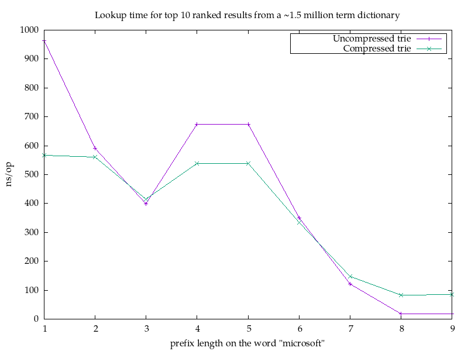

# Pruning Radix Trie

A Go port of the [Pruning Radix
Trie](https://github.com/wolfgarbe/PruningRadixTrie), an augmented compresed
trie that orders nodes based upon the maximum _rank_ of the items in their
subtree. This allows it to quickly search and find _k_ elements with the highest
rank. You decide what the rank is for each item.

The most obvious use case would be autocomplete: Finding the top 10 used words
with a given prefix is cheap with this data structure.

## Usage

TODO

## Notes on Performance

I'm a bit confused about the performance of the original implementation. The
benchmark image shows nanoseconds, yet the post talks about microseconds, and
the numbers are off by 1000 in either direction. Either the benchmark image
should show microseconds or the post should talk about microseconds. Given the
presentation, it seems like the benchmark image should talk about microseconds
and non nanoseconds.

Also, I'm not sure if the benchmark even has 6 million dictionary words in it:
[There's some code pruning away
bigrams](https://github.com/wolfgarbe/PruningRadixTrie/blob/e86ca38918f03582d9e4316a1d6613986d4b5f82/PruningRadixTrie/PruningRadixTrie.cs#L242-L249)
and if I'm doing that with the original term file, I get 1,457,852 dictionary
words.

Additionally, the "microsoft" lookup result is a little weird. Both
implementations should scan down to the subtrie with the "microsoft" prefix, and
there are no children underneath that node in my implementation. Consequently I
would expect identical performance for those (.. well, better if we use trie
properties), not an improvement for the pruning radix trie.

Anyway, I don't think there's much point in comparing this trie with an
exhaustive search, which is the best a standard patricia trie would be able to
do. Instead I wanted to highlight the difference between a patricia/compressed
trie and an uncompressed one:

The results aren't that surprising: The compressed trie will have far fewer
empty nodes, and so scanning a trie for top ranked items is gonna be cheaper
when there's fewer nodes to visit. When the walk down the trie is effectively
all you do, you'd prefer that to be more performant (the logic for that is
simpler in the uncompressed case).

Also, this benchmark looks better than it probably should for the uncompressed
case, as more or less all the nodes will be in the cache. In a real world
scenario, the compressed trie will likely fare better than the uncompressed
because of cache invalidation etc.

## License

Copyright © 2023 Jean Niklas L'orange

Distributed under the BSD 3-clause license, which is available in the file
LICENSE.
