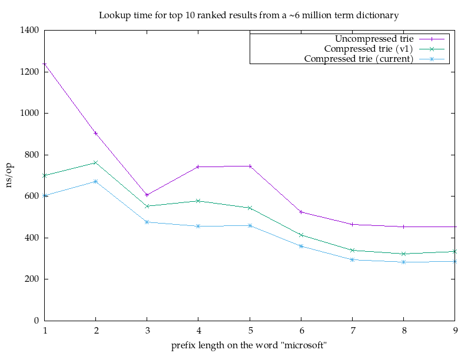

# Pruning Radix Trie

[](https://godoc.org/olympos.io/container/pruning-radix-trie)

A Go port of the [Pruning Radix
Trie](https://github.com/wolfgarbe/PruningRadixTrie), an augmented compressed
trie that orders nodes based upon the maximum _rank_ of the items in their
subtree. This allows it to quickly search and find _k_ elements with the highest
rank. You decide what the rank is for each item.

The most obvious use case would be autocomplete: Finding the top 10 used words
with a given prefix is cheap with this data structure.

## Usage

To use it, add the library to your `go.mod` file by issuing

```shell
$ go get olympos.io/container/pruning-radix-trie
```

and import it like so:

```go
import ptrie "olympos.io/container/pruning-radix-trie"
```

The library contains in practice two functions you use to interact with it:

- `FromItems`, which is used to build an immutable pruning radix trie, and
- `PTrie.FindTopK` to find the top _k_ ranked items with a given prefix

Here's a small standalone example of how they are used:

```go
package main

import (
	"fmt"

	ptrie "olympos.io/container/pruning-radix-trie"
)

type empty struct{}

func main() {
	trie := ptrie.FromItems([]ptrie.Item[empty]{
		{Term: "hello", Rank: 1000},
		{Term: "hi", Rank: 871},
		{Term: "howdy", Rank: 70},
		{Term: "goodbye", Rank: 918},
	})

	top := trie.FindTopK("h", 4)
	for _, res := range top {
		fmt.Printf("%s (rank %d)\n", res.Term, res.Rank)
	}
	// hello (rank 1000)
	// hi (rank 871)
	// howdy (rank 70)
}
```

## Notes on Performance

I'm a bit confused about the performance of the original implementation. The
benchmark image shows nanoseconds, yet the post talks about microseconds, and
the numbers are off by 1000 in either direction. Either the benchmark image
should show microseconds or the post should talk about microseconds. Given the
presentation, it seems like the benchmark image should talk about microseconds
and not nanoseconds.

I don't think there's much point in comparing this trie with an
exhaustive search, which is the best a standard Patricia trie would be able to
do. Instead, I wanted to highlight the difference between a Patricia/compressed
trie and an uncompressed one:



The results aren't that surprising: The compressed trie will have far fewer
empty nodes, and so scanning a trie for top-ranked items is gonna be cheaper
when there are fewer nodes to visit. When the walk down the trie becomes more
and more of the work, you'd prefer that to be efficient. The logic for that is
simpler in the uncompressed case, and if you end up with very few nodes to
evaluate after that, the uncompressed case could perform better in benchmarks.

However, this benchmark looks better than it probably should for the
uncompressed case, as more or less all the nodes will be in the cache. In a
real-world scenario, the compressed trie will likely fare better than the
uncompressed because of cache invalidation etc.

## License

Copyright © 2023 Jean Niklas L'orange and contributors

Distributed under the BSD 3-clause license, which is available in the file
LICENSE.
